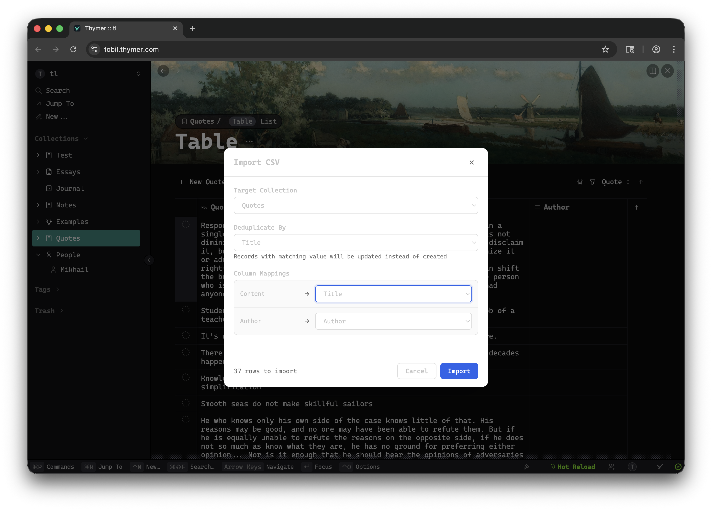

# CSV Importer Plugin for Thymer

A global AppPlugin that imports CSV files into any Thymer collection. One record per row.




## Features

- Command palette: `Cmd+P` → "Import CSV to Collection"
- Choose target collection (defaults to currently open collection)
- Map CSV columns to: Title, Content, Properties, or Discard
- Deduplicate by unique field (default: title) - last row wins
- Smart defaults for columns named `title`, `name`, `body`, `content`, `description`, or matching property names

## Installation

1. In Thymer, `Cmd+P` → "Plugins"
2. Create a new Global Plugin
3. Paste contents of `plugin.js` into Code Editor
4. Paste contents of `plugin.json` into Configuration

## Usage

1. `Cmd+P` → "Import CSV to Collection"
2. Select a CSV file
3. Choose target collection
4. Configure column mappings
5. Click Import

## CSV Format

```csv
title,description,status,author
My First Item,Some description,active,John Doe
Another Item,More text,pending,Jane Smith
```

- First row must be headers
- Supports quoted fields with commas and newlines
- Empty titles are skipped

## Known Limitations

Setting properties on records from an AppPlugin doesn't work reliably due to SDK limitations. Records are created with correct titles, but property values may not persist.

## Files

```
plugin.js      # Plugin source code
plugin.json    # Plugin configuration
example.csv    # Sample CSV file
```
